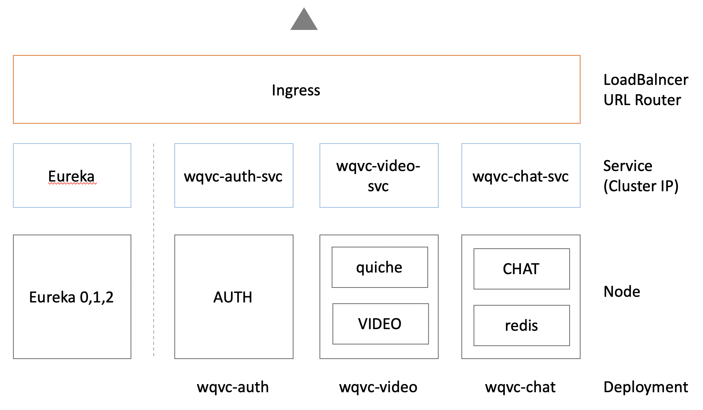

# WQVC-kubernetes
WQVC(WebRTC-QUIC Video Conference) 프로젝트를 위한 kubernetes 설정.

## 서비스의 구조
위 서비스의 대략적인 구조는 다음과 같습니다.




## 진행 방법

### 0) git clone

```
git clone https://github.com/SKrns/WQVC-kubernetes.git
```


### 1) Ingress Controller 배포 및 Ingress Service 설정 

네이버 클라우드 플랫폼의 튜토리얼`https://docs.ncloud.com/ko/nks/nks-1-4.html` 을 참고하여 진행.

```
kubectl --kubeconfig $KUBE_CONFIG apply -f https://raw.githubusercontent.com/kubernetes/ingress-nginx/2de5a893aa15f14102d714e918b0045b960ad1a5/deploy/static/mandatory.yaml

kubectl --kubeconfig $KUBE_CONFIG apply -f ingress-service.yaml
```


### 2) Application 및 서비스 배포

`EUREKA`,`AUTH`,`VIDEO`,`CHAT` 마이크로 서버를 배포. 

```
kubectl --kubeconfig $KUBE_CONFIG apply -f eureka-deployment.yaml
kubectl --kubeconfig $KUBE_CONFIG apply -f auth-deployment.yaml
kubectl --kubeconfig $KUBE_CONFIG apply -f chat-deployment.yaml
kubectl --kubeconfig $KUBE_CONFIG apply -f video-deployment.yaml
```


### 3) Ingress 생성

```
kubectl --kubeconfig $KUBE_CONFIG apply -f ingress.yaml
```


## WQVC 프로젝트 링크

- https://github.com/Pororo-droid/WQVC-eurkeaServer

- https://github.com/SKrns/WQVC-AUTH

- https://github.com/SKrns/WQVC-CHAT

- https://github.com/SKrns/WQVC-VIDEO

- https://github.com/SKrns/WQVC-kubernetes

  

